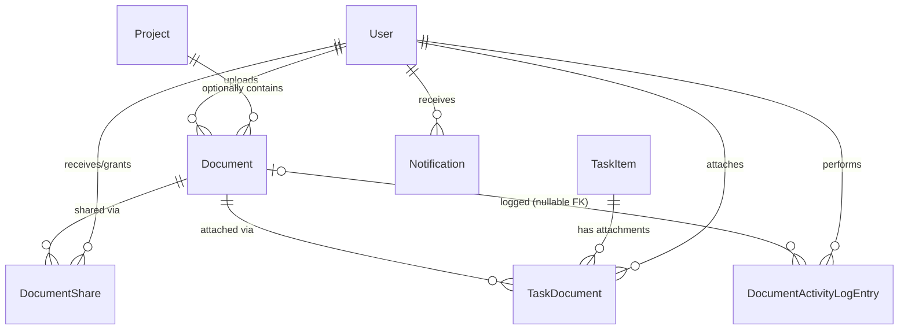

# Phase 1 Data Model: Document Upload and Management

Source: functional requirements and Key Entities in [spec.md](./spec.md); representation decisions from [research.md](./research.md).

## Entity: Document

Represents an uploaded file and its metadata. Belongs to exactly one uploader; optionally belongs to one project.

| Field | Type | Rules |
|---|---|---|
| `DocumentId` | `int` (PK, identity) | — |
| `Title` | `string` | Required, max length 255 |
| `Description` | `string?` | Optional, max length 2000 |
| `Category` | `DocumentCategory` (enum, persisted as string via `HasConversion<string>()`) | Required. One of: `ProjectDocuments`, `TeamResources`, `PersonalFiles`, `Reports`, `Presentations`, `Other` |
| `Tags` | `string?` | Optional, max length 500, comma-separated free-form tags |
| `ProjectId` | `int?` (FK → Project) | Optional. When set, document is visible in that project's Project Documents view |
| `UploadedByUserId` | `int` (FK → User) | Required. The uploader/owner for authorization purposes |
| `UploadDate` | `DateTime` | Set to `DateTime.UtcNow` at creation; immutable |
| `UpdatedDate` | `DateTime` | Set to `DateTime.UtcNow` at creation, updated on metadata edit or file replace |
| `FileSizeBytes` | `long` | Required. Must be > 0 and ≤ 26,214,400 (25 MB) |
| `FileType` | `string` | Required, max length 255 (accommodates long Office MIME types per stakeholder doc) |
| `OriginalFileName` | `string` | Required, max length 255. Display-only; never used to construct a storage path |
| `StoragePath` | `string` | Required, max length 500. Server-generated relative path (`{userId}/{projectId-or-"personal"}/{guid}.{ext}`); unique |

**Validation rules** (enforced in `DocumentService`, independent of any client-side checks):
- `FileType`/file extension must be in the allow-list: PDF, DOC/DOCX, XLS/XLSX, PPT/PPTX, TXT, JPEG/JPG, PNG.
- `FileSizeBytes` ≤ 25 MB.
- `Title` and `Category` required; `Category` must be a defined `DocumentCategory` value.
- If `ProjectId` is set, the uploading user must be a member or manager of that project (or an Administrator), re-verified server-side.
- File must pass `IMalwareScanService.ScanAsync()` before `StoragePath` is persisted or the file is written to disk.

**Relationships**:
- `User` (1) —< `Document` (many) via `UploadedByUserId`, `DeleteBehavior.Restrict` (a user cannot be deleted while owning documents; out of scope to change user-deletion behavior in this feature).
- `Project` (1) —< `Document` (many, optional) via `ProjectId`, `DeleteBehavior.Restrict`.
- `Document` (1) —< `DocumentShare` (many), `DeleteBehavior.Cascade`.
- `Document` (1) —< `TaskDocument` (many), `DeleteBehavior.Cascade`.
- `Document` (1) —< `DocumentActivityLogEntry` (many), `DeleteBehavior.Restrict` with nullable FK (see entity below).

**State / lifecycle**: Created on successful upload (file write + DB insert as one logical operation per FR-009 — if either half fails, the other is rolled back/cleaned up). Updated in place on metadata edit (FR-016) or file replace (FR-017, same validation as initial upload, `StoragePath` regenerated, old file removed only after new file + DB update succeed). Hard-deleted (no soft-delete flag) on authorized deletion (FR-018), cascading to `DocumentShare` and `TaskDocument` rows per research.md §8.

## Entity: DocumentShare

Represents a sharing relationship granting a specific recipient user view/download/preview access to a specific document (per spec Clarifications — no edit/delete rights).

| Field | Type | Rules |
|---|---|---|
| `DocumentShareId` | `int` (PK, identity) | — |
| `DocumentId` | `int` (FK → Document) | Required |
| `SharedWithUserId` | `int` (FK → User) | Required. The recipient |
| `SharedByUserId` | `int` (FK → User) | Required. Must be the document's uploader at time of sharing |
| `SharedDate` | `DateTime` | Set to `DateTime.UtcNow` at creation |

**Constraints**: Unique index on (`DocumentId`, `SharedWithUserId`) — a document can only be shared once with a given user (re-sharing is a no-op or updates `SharedDate`, decided at implementation time).

**Relationships**: `Document` (1) —< `DocumentShare` (many), cascade delete. `User` (1) —< `DocumentShare` (many) via both `SharedWithUserId` and `SharedByUserId`, `DeleteBehavior.Restrict` on both.

## Entity: DocumentActivityLogEntry

Represents a recorded document-related action for audit/compliance reporting (FR-024, FR-025).

| Field | Type | Rules |
|---|---|---|
| `DocumentActivityLogEntryId` | `int` (PK, identity) | — |
| `DocumentId` | `int?` (FK → Document, nullable) | Nullable so the row survives document deletion (see research.md §8) |
| `DocumentTitleSnapshot` | `string` | Required, max length 255. Captures the document's title at the time of the action, so reports remain meaningful after deletion |
| `UserId` | `int` (FK → User) | Required. Who performed the action |
| `ActionType` | `DocumentActivityType` (enum, persisted as string) | Required. One of: `Upload`, `Download`, `Delete`, `Share` |
| `Timestamp` | `DateTime` | Set to `DateTime.UtcNow` at creation |

**Relationships**: `Document` (1) —< `DocumentActivityLogEntry` (many, optional), `DeleteBehavior.Restrict` (FK set to `null` is not automatic under Restrict — service layer explicitly nulls `DocumentId` as part of the delete transaction before removing the `Document` row, or configures `DeleteBehavior.SetNull` as the simpler EF-native option). `User` (1) —< `DocumentActivityLogEntry` (many) via `UserId`, `DeleteBehavior.Restrict`.

> Implementation note: prefer `DeleteBehavior.SetNull` over manual nulling for `DocumentId` to keep the delete operation a single `SaveChangesAsync()` call.

## Entity: TaskDocument (join entity)

Represents a document attached to a task (FR-021). Enables many-to-many: a document may be attached to multiple tasks; a task may have multiple attached documents.

| Field | Type | Rules |
|---|---|---|
| `TaskDocumentId` | `int` (PK, identity) | — |
| `TaskId` | `int` (FK → TaskItem) | Required |
| `DocumentId` | `int` (FK → Document) | Required |
| `AttachedByUserId` | `int` (FK → User) | Required |
| `AttachedDate` | `DateTime` | Set to `DateTime.UtcNow` at creation |

**Constraints**: Unique index on (`TaskId`, `DocumentId`) — a document cannot be attached to the same task twice.

**Relationships**: `TaskItem` (1) —< `TaskDocument` (many), `DeleteBehavior.Cascade` (deleting a task removes its attachment links; it does not delete the underlying `Document`). `Document` (1) —< `TaskDocument` (many), `DeleteBehavior.Cascade` (per research.md §8). On creation, the associated `Document.ProjectId` MUST be set to the task's `ProjectId` if not already set (FR-021: "automatically be associated with the task's project").

## Modified Entity: Notification

Existing `NotificationType` enum (`Models/Notification.cs`) gains two new members to support FR-023:

| New enum member | Triggered when |
|---|---|
| `DocumentShared` | A document is shared with a user (FR-020) |
| `DocumentAddedToProject` | A new document is uploaded into a project the recipient is a member of (FR-023) |

No changes to the `Notification` entity's schema — only enum values added. Existing `Notification` fields (`Title`, `Message`, `Type`, `Priority`, `IsRead`) are reused as-is.

## Entity Relationship Summary

## DbContext Changes Summary (for `Data/ApplicationDbContext.cs`)

New `DbSet<T>` properties: `Documents`, `DocumentShares`, `DocumentActivityLogEntries`, `TaskDocuments`.

New `OnModelCreating` configuration:
- `Document.Category` → `.HasConversion<string>()`.
- `DocumentActivityLogEntry.ActionType` → `.HasConversion<string>()`.
- Cascade: `Document → DocumentShare`, `Document → TaskDocument`.
- Restrict/SetNull: `Document → DocumentActivityLogEntry` (`SetNull`), `User → Document`, `Project → Document`, `TaskItem → TaskDocument` (`Cascade`, as above).
- Unique indexes: `DocumentShare(DocumentId, SharedWithUserId)`, `TaskDocument(TaskId, DocumentId)`.
- Performance indexes (supporting FR-028's 2s search/list targets): `Document(UploadedByUserId)`, `Document(ProjectId)`, `Document(Category)`, `Document(UploadDate)`.

No EF Core Migrations are added; schema changes flow through the existing `Database.EnsureCreated()` call per research.md §4.
